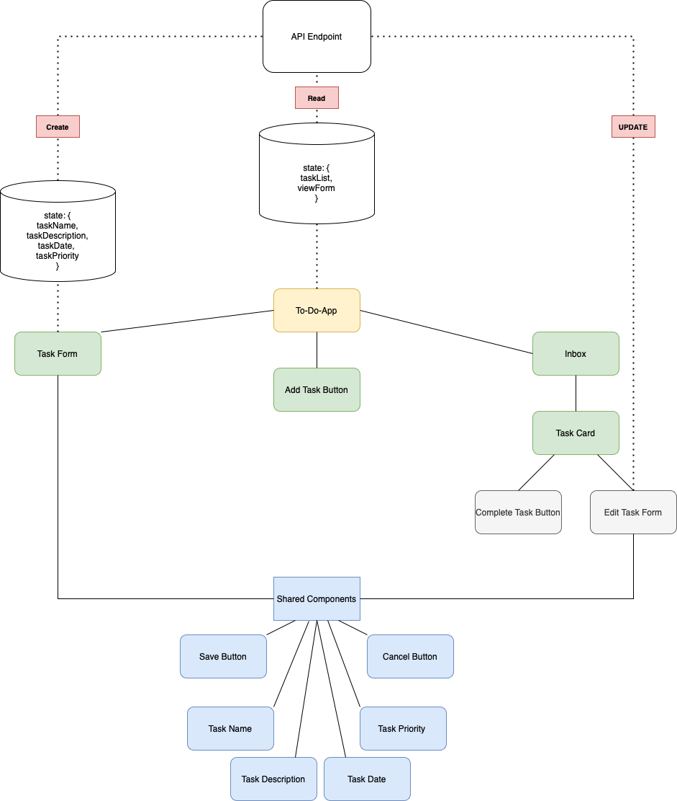
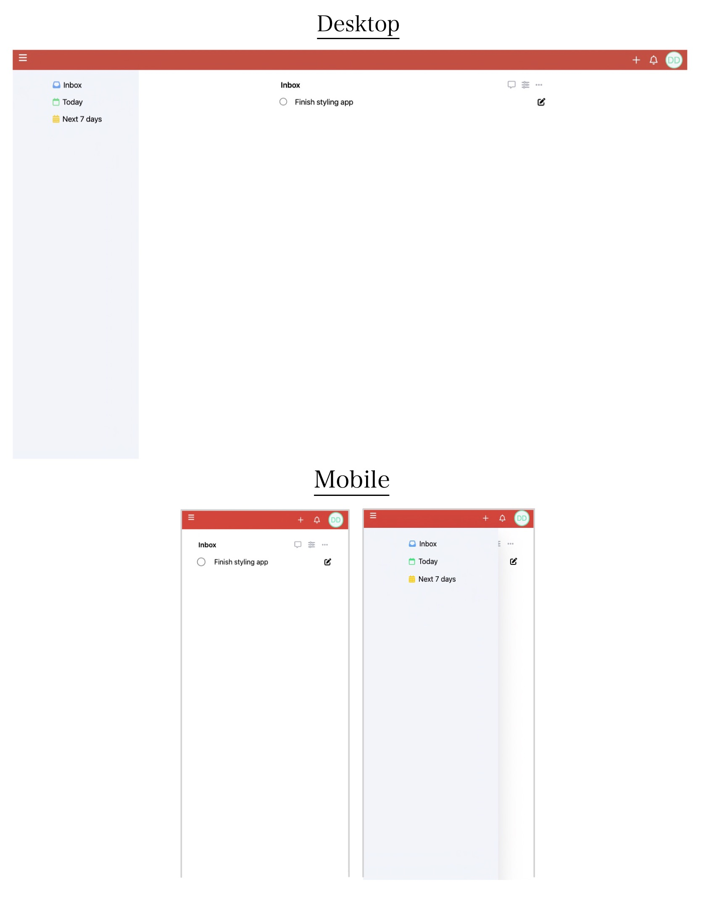

# Minimalist To Do App - Inspired by ToDoIst and Shia 
This simple to-do-list app allows a user to manage task's with basic **CRUD** functionality

[Click here to use the application](https://just-do-it-6wsb.vercel.app)

## Project Description
This project is a frontend application built using **React.JS** and **Tailwind CSS** while leveraging JSONbin.io for data storage. My primary goal with this app was to learn more about using React hooks and practice pushing and retrieving data from an API. 

### `Component hierarchy and Design`

 

## Check out my Notion Doc
For more details on the steps towards building this project, including component logic and some of the blocker's I faced and how I solved them [click here to open my Notion Document](https://www.notion.so/To-Do-List-App-3617375c1a5048f396fb2ccc0c3e3e02)

### `npm start`

Runs the app in the development mode.\
Open [http://localhost:3000](http://localhost:3000) to view it in your browser.

### `npm run build` fails to minify

This section has moved here: [https://facebook.github.io/create-react-app/docs/troubleshooting#npm-run-build-fails-to-minify](https://facebook.github.io/create-react-app/docs/troubleshooting#npm-run-build-fails-to-minify)
