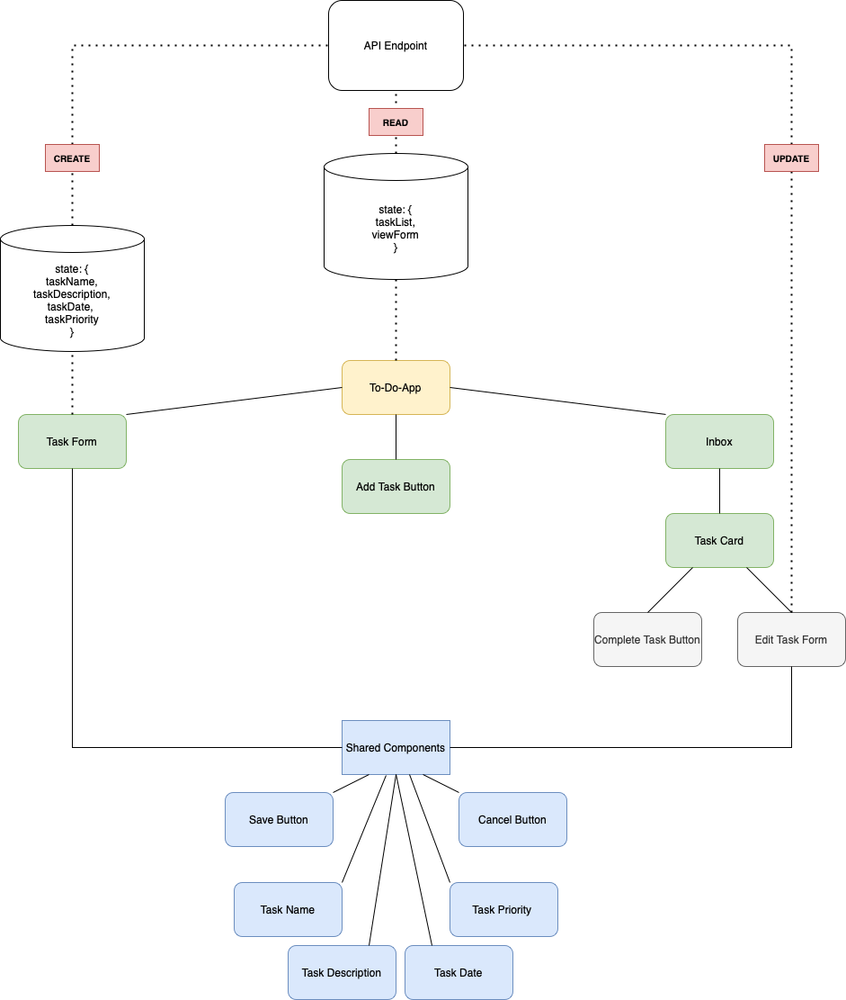

# Minimalist Weather App [V1 - Sept 12, 2022]

[Click here to use the application]

## Project Description

### `Component hierarchy and Design`

 

### `Build Details`
For more details on the steps towards building this project, including component logic and some of the blocker's I faced and how I solved them [click here to access my Notion Document](https://stripe-parade-9b5.notion.site/Weather-App-cf7c602efeae40fa9d6b6fe8b46256be)

### `npm start`

Runs the app in the development mode.\
Open [http://localhost:3000](http://localhost:3000) to view it in your browser.

The page will reload when you make changes.\
You may also see any lint errors in the console.

This section has moved here: [https://facebook.github.io/create-react-app/docs/advanced-configuration](https://facebook.github.io/create-react-app/docs/advanced-configuration)

### Deployment

This section has moved here: [https://facebook.github.io/create-react-app/docs/deployment](https://facebook.github.io/create-react-app/docs/deployment)

### `npm run build` fails to minify

This section has moved here: [https://facebook.github.io/create-react-app/docs/troubleshooting#npm-run-build-fails-to-minify](https://facebook.github.io/create-react-app/docs/troubleshooting#npm-run-build-fails-to-minify)
